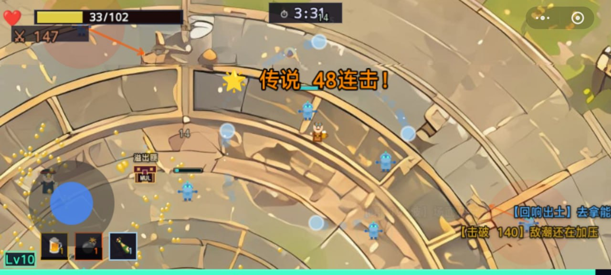
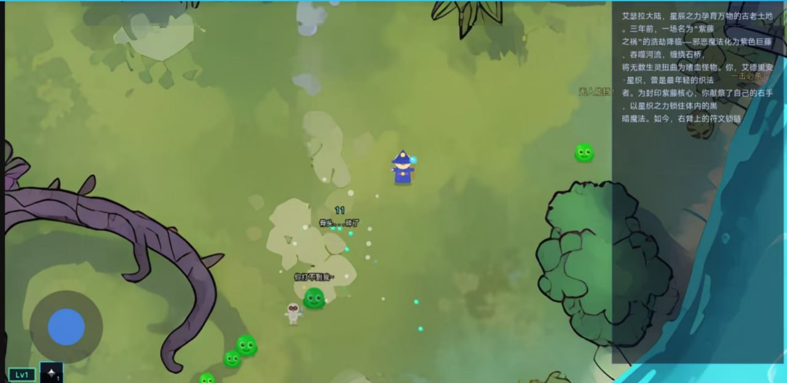

<div align="center">

# 艾德里安·星织

**Adrian Starweaver**

一款在 AI Game 黑客松中诞生的浏览器生存动作游戏：玩家只负责移动，法术自动释放，AI 则参与升级决策、角色台词与叙事表达。

**学 AI，上 [LINUX DO](https://linux.do/)。**

[](https://phaser.io/)
[](https://www.typescriptlang.org/)
[](https://vite.dev/)
[](LICENSE)


</div>

## 项目简介

《艾德里安·星织》是一个“割草生存 + 自动施法 + 卡牌成长 + AI 叙事”的 H5 游戏原型。项目源于一场主题为 **“你只能做一件事”** 的 AI Game 黑客松，因此将操作收敛到一件事：**移动**。

玩家需要在约 5 分钟的单局流程中穿越地图、躲避怪物并完成阶段任务。攻击和技能由系统自动执行；升级时从卡牌中构筑法术组合，AI 魔导师会结合当前生命、等级、属性、法术栏和剩余时间给出选择建议。

这不是一个“一句话生成游戏”的展示，而是一次关于如何组织 AI 完成游戏开发的实践：先用文档收敛需求，再由专职 Agent 协作完成程序、美术、音频、叙事和测试，最后通过人工调参与素材处理提升完成度。

## 前因后果

灵感来自《咒语旅团》等强调满屏敌人、自动施法和高频成长反馈的作品。赛前尝试过通用 AI 编码、OpenPencil、MuleRun 等方案后，最终选择基于 [Claude-Code-Game-Studios](https://github.com/Donchitos/Claude-Code-Game-Studios) 组织开发流程。

比赛中先完成玩法、系统、故事和表现文档，真正用于编码与联调的时间约 6 小时。AI 很快搭出了可运行骨架，但地图、碰撞遮罩、角色图标、技能差异、受击反馈和整体节奏仍依赖大量人工调整。项目最终完成了可玩的黑客松 Demo，并获得比赛奖项。

完整的工具选择、开发过程与踩坑记录见：[一次 AI 游戏黑客松复盘](aritcle/article_optimized.md)。

## 微信小程序转换效果

下图是我自行将本项目转换并适配为微信小程序后的实际运行效果，并非原始 H5 版本的官方截图：



下面是项目实际运行中的探索、战斗与剧情界面，展示了法师角色、史莱姆敌人、虚拟摇杆、等级 HUD 和剧情文本面板：



## 核心玩法

- **单一操作**：键盘或虚拟摇杆控制移动，法术自动寻找目标并释放。
- **五分钟生存**：敌人随时间增强，在连续任务和战斗压力下完成一局挑战。
- **卡牌构筑**：升级时从随机卡牌中选择法术或属性强化，逐步形成自己的 Build。
- **动态地图**：`4096 × 4096` 世界由 16 张地图切片组成，并使用对应遮罩生成不可通行区域。
- **即时反馈**：技能特效、独立音效、受击反馈、任务横幅和战斗弹幕共同呈现战局变化。
- **剧情推进**：故事随任务进度逐段展开，并根据完成情况进入不同结局。
- **桌面与移动端输入**：支持键盘操作，也包含触屏虚拟摇杆。

## AI 如何进入玩法

AI 不是独立的聊天窗口，而是嵌入已有游戏循环：

1. **升级建议**：`AiAdvisor` 将玩家状态与候选卡牌整理为结构化上下文，请 AI 魔导师推荐当前更合适的选择并说明理由。
2. **角色台词**：`BubbleTextGenerator` 按怪物类型和出生、追击、受伤、死亡等状态生成短台词，使角色反馈更贴近战况。
3. **叙事与提示**：任务旁白、角色气泡和弹幕系统把世界观、成长进度与战斗事件放回游戏画面，而不是堆在独立说明面板中。
4. **离线兜底**：AI 请求失败或未启用时，游戏会使用内置台词继续运行，核心战斗不依赖模型服务。

> AI 请求统一发送到同源 `/api/ai`，由 Vercel Serverless Function 读取服务端环境变量并转发到 OpenAI 兼容接口。浏览器不会获得硅基流动的 API Key、Base URL 或模型配置；AI 未配置或请求失败时，核心战斗和内置台词仍可正常运行。

## Vercel 部署

1. 将仓库导入 Vercel，Framework Preset 选择 **Vite**。
2. 在 **Project Settings → Environment Variables** 添加：

| 变量 | 必需 | 示例 |
| --- | --- | --- |
| `SILICONFLOW_API_KEY` | 是 | 在硅基流动控制台创建的新 Key |
| `SILICONFLOW_BASE_URL` | 是 | `https://api.siliconflow.cn` |
| `SILICONFLOW_MODEL` | 否 | `deepseek-ai/DeepSeek-V3.2` |

3. 对 Production、Preview、Development 环境按需启用变量，然后重新部署。

本地联调 Vercel Function 时，复制 `.env.example` 为被 Git 忽略的 `.env.local`，填入新 Key，并使用 Vercel CLI 启动：

```bash
npm install
npx vercel dev
```

仅执行 `npm run dev` 会启动 Vite 前端，不会运行 `/api/ai` Serverless Function；此时游戏会自动使用内置台词降级运行。

> 不要使用 `VITE_` 前缀保存密钥。Vite 会把所有 `VITE_*` 环境变量打包并暴露给浏览器。

## 技术栈

| 层级 | 技术 | 用途 |
| --- | --- | --- |
| 游戏引擎 | [Phaser 3.90](https://phaser.io/) | 场景、渲染、输入、音频与 Arcade Physics |
| 开发语言 | [TypeScript 5.9](https://www.typescriptlang.org/) | 游戏逻辑、类型约束和模块组织 |
| 构建工具 | [Vite 6.4](https://vite.dev/) | 本地开发、资源加载与生产构建 |
| 测试工具 | [Vitest 3.2](https://vitest.dev/) | 已配置测试命令，测试用例尚待补充 |
| AI 接口 | OpenAI-compatible Chat Completions | 通过 Vercel `/api/ai` 服务端代理调用，密钥不进入浏览器 |
| 资源管线 | JPG / SVG / MP3 / WAV + Phaser Loader | 地图、遮罩、角色、特效与音频加载 |
| 协作方式 | Claude Code + 48 个专职 Agent | 文档、程序、美术、音频、叙事和 QA 协作 |

### 架构概览

游戏采用按职责拆分的系统化结构：

- **Scenes** 管理启动、菜单、单局与结算生命周期。
- **Core** 提供事件总线、输入、计时器、对象池、碰撞和地图遮罩能力。
- **Systems** 分别处理敌人生成、战斗、法术、掉落、升级、任务、气泡和特效。
- **Entities** 封装玩家、敌人、投射物与拾取物状态。
- **Data** 保存敌人、法术、升级、特效和剧情配置。
- **UI** 独立呈现 HUD、升级卡牌、任务、旁白、弹幕和虚拟摇杆。

系统之间主要通过 `EventBus` 传递战斗与进度事件；高频生成的敌人、投射物和拾取物使用 `ObjectPool` 复用，减少运行时对象分配。

## 快速开始

### 环境要求

- [Node.js](https://nodejs.org/) 18 或更高版本
- npm（仓库同时保留 `pnpm-lock.yaml`，也可使用 pnpm）

### 本地运行

```bash
git clone https://github.com/koala9527/AdrianStarweaver.git
cd AdrianStarweaver
npm install
npm run dev
```

Vite 默认启动在 <http://localhost:3000>。

### 操作方式

| 场景 | 键盘 | 移动端 |
| --- | --- | --- |
| 菜单 | `W` / `S` 选择，`Space` / `Enter` 确认 | 点击按钮 |
| 游戏 | `WASD` 或方向键移动 | 左下角虚拟摇杆 |
| 升级 | 点击升级卡牌 | 点击升级卡牌 |

### 构建与测试

```bash
npm run build
npm test
npm run preview
```

构建产物输出到 `dist/`，Vite 使用相对资源路径，可部署到常见静态站点服务。

## 项目结构

```text
AdrianStarweaver/
├── src/
│   ├── main.ts                  # Phaser 配置与场景注册
│   └── game/
│       ├── config/              # 游戏与 AI 配置
│       ├── core/                # 事件、输入、计时、对象池和碰撞
│       ├── data/                # 法术、敌人、升级、剧情和 VFX 数据
│       ├── entities/            # 玩家、敌人、投射物和拾取物
│       ├── scenes/              # Boot、Menu、Run、Result 场景
│       ├── services/            # AI 建议与动态台词服务
│       ├── systems/             # 战斗、法术、任务、生成和成长系统
│       └── ui/                  # HUD、卡牌、旁白、弹幕和摇杆
├── public/
│   ├── audio/                   # 背景音乐与技能音效
│   ├── map/                     # 地图切片与碰撞遮罩
│   └── sprites/                 # 角色、敌人与拾取物素材
├── aritcle/                     # 黑客松复盘文章与过程图片
├── .claude/                     # Agent、工作流、规则与协作文档
└── production/                  # 制作过程与会话状态
```

## 开发过程中的 AI 分工

- **Claude Code / Claude Code CLI**：主力编码与多 Agent 协作。
- **ChatGPT**：需求整理、边界收敛与文档补全。
- **Gemini**：背景音乐、技能音效及部分视觉素材。
- **AI 绘图工具**：首页图与地图原图。
- **Photoshop + 人工处理**：地图切片、高清化、碰撞遮罩、坐标和最终视觉调优。

这套流程的核心经验是：AI 擅长快速把工程推到可运行状态，但需求边界、审美一致性、玩法节奏和最终质量仍需要人做判断。

## 当前状态

项目目前是黑客松阶段的 `v0.1 / M1 Prototype`，核心单局、任务、升级、AI 建议、动态台词、地图碰撞和结算流程已经可运行。它更适合作为可玩的原型与 AI 协作开发案例，而不是完整商业游戏。

已知的工程化方向包括：

- 将模型调用迁移到服务端代理，避免浏览器暴露密钥。
- 补充更多自动化测试和端到端游戏流程验证。
- 继续优化移动端 UI、资源体积和低性能设备表现。
- 扩展敌人、法术、任务与 Build 组合，同时保持单局节奏清晰。

## 参与贡献

欢迎通过 [Issues](https://github.com/koala9527/AdrianStarweaver/issues) 提交 Bug、玩法建议或技术改进。提交代码前请先说明修改目标，尽量保持系统职责边界和数据驱动方式，并确保以下命令通过：

```bash
npm run build
# 添加测试用例后再执行：npm test
```

## 致谢

- [Claude-Code-Game-Studios](https://github.com/Donchitos/Claude-Code-Game-Studios)：提供游戏工作室式 Agent 架构与协作流程。
- Phaser、TypeScript、Vite 与 Vitest 社区。
- 黑客松队友及参与素材生成、地图处理和现场测试的所有人。

## License

本项目基于 [MIT License](LICENSE) 开源。
