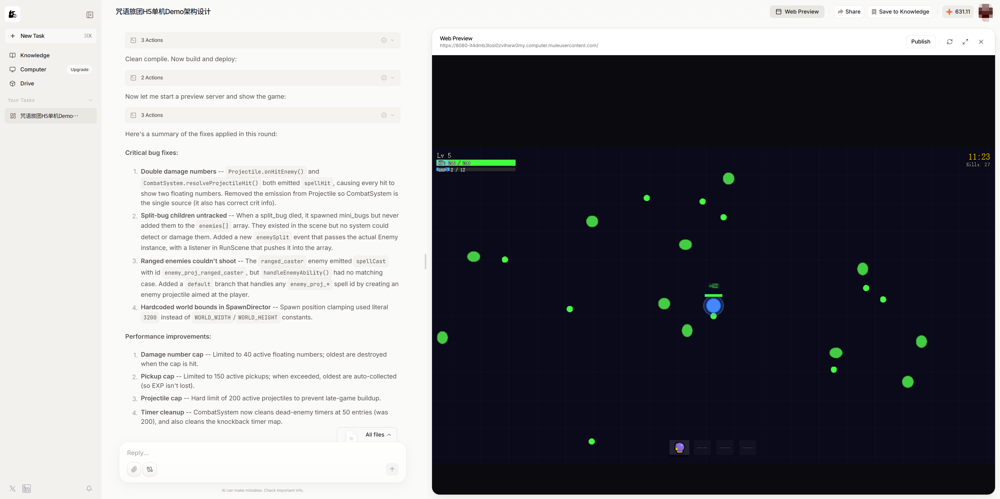
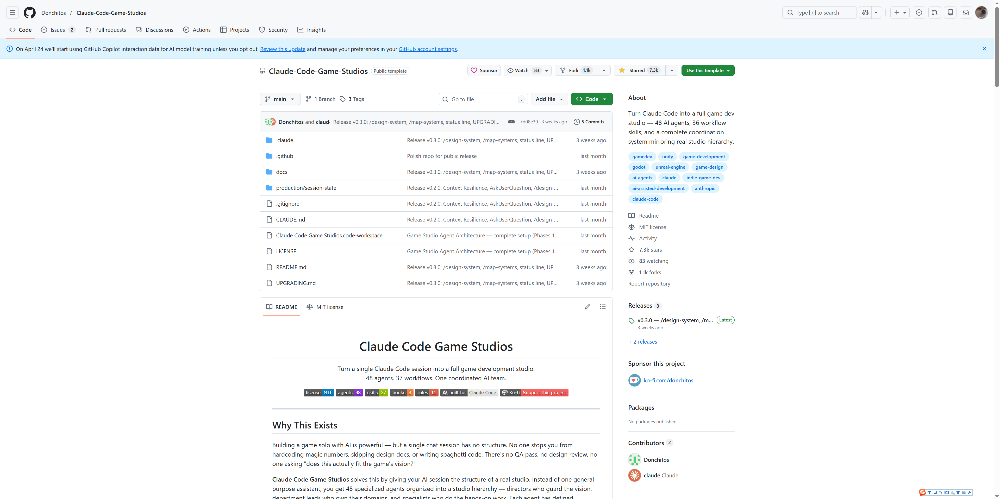
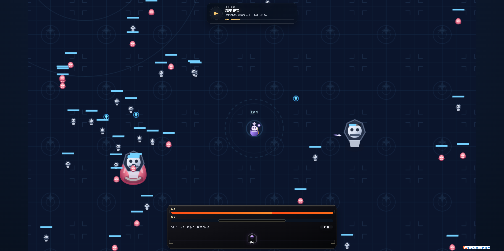
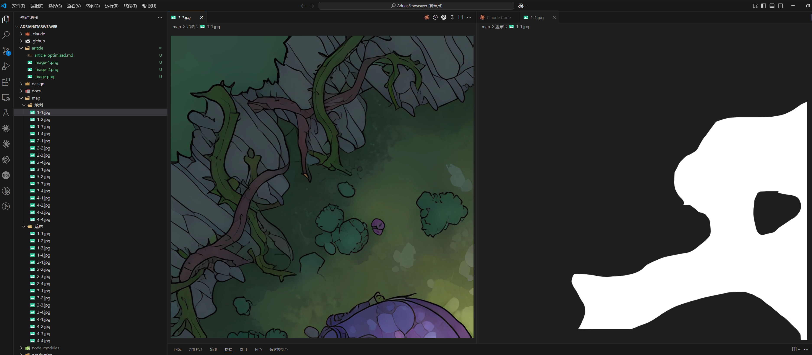
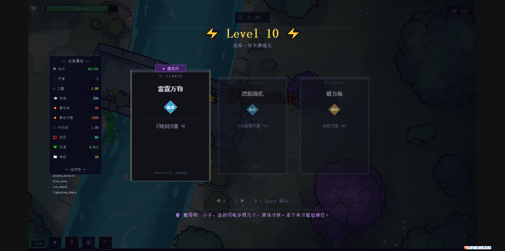

# 一次 AI 游戏黑客松复盘：从灵感、踩坑到最终得奖

前几天，我参加了一场 AI Game 黑客松，最后顺利得奖。趁热记录一下这次做游戏 Demo 的过程：从选题、调研、工具试错，到最后 6 小时冲刺把作品做出来。

这篇文章尽量只讲有用的部分：AI 到底帮了什么，哪些地方仍然要靠人工，以及在比赛场景里，怎样把 AI 真正组织起来。

## 一、起点：为什么会做这个方向

最近我经常在抖音刷到《咒语旅团》这类游戏内容：满屏怪物、自动施法、卡牌升级、视觉反馈强，非常适合短视频传播。

我当时就在想：如果把这种“割草 + 成长 + 高频反馈”的框架抽出来，再结合 AI 玩法，是不是可以在黑客松里快速做出一个完成度不错的 Demo。

刚好，这次比赛给了我验证这个想法的机会。

## 二、赛前调研：先试工具，再定方案

比赛开始前一周，我先做了几轮调研，而不是直接开写。

### 1. 先让 ChatGPT 收敛需求

我先让 ChatGPT 帮我整理一版游戏需求，核心思路是：

- 参考《咒语旅团》这类割草/动作射击玩法；
- 去掉联机、多角色等高复杂度内容；
- 压缩成长周期，让一局体验控制在几分钟；
- 补齐玩法说明和参考资料，方便继续喂给其他模型。

这一步很重要，因为 AI 编码最怕需求模糊。文档越清楚，返工越少。

### 2. 直接让模型写 Demo

接着我试了用 Claude Code 和 ChatGPT 直接生成代码。

结果是：

- 启动很快，骨架很快能跑起来；
- 逻辑层面没问题；
- 但美术、UI、图标、地图表现都比较弱。

也就是说，AI 很擅长先把“能跑的东西”搭出来，但比赛里真正拉开差距的，还是画面、反馈和节奏。

## 三、我试过的几个工具

### 1. OpenPencil

我试了 `OpenPencil`（也就是现在的 Pencil 方向工具）。它本质上是一个开源设计编辑器，支持 `.fig` 文件、Figma 工作流，也内置 AI 和可编程能力。

- 官网：<https://openpencil.dev/>

它适合做界面草图、UI 结构和设计协作，但对这次比赛来说，它更像“设计工具”，不是直接产出游戏素材的流水线，所以最后没有成为主力。

### 2. MuleRun

我也试了 `MuleRun`。

- 官网：<https://mulerun.com/creator>

它更像 AI Agent 的 Creator Studio，重点是构建、发布、托管和变现 AI Agent，而不是传统意义上的游戏引擎。

所以它对做 AI 产品很有意思，但对这次“快速落地一个可玩的动作游戏 Demo”来说，并不是最顺手的方案。

### 3. Claude-Code-Game-Studios

真正对我帮助最大的，是 `Claude-Code-Game-Studios`：

- 项目地址：<https://github.com/Donchitos/Claude-Code-Game-Studios>

这个项目最有价值的地方，不是“自动生成游戏”，而是它把 Claude Code 的工作方式组织成一个更像游戏工作室的流程：

- 多个专职 Agent；
- 成套工作流和规则；
- 更强调文档、分工、校验和协作。

它很适合比赛场景，因为黑客松里最浪费时间的，往往不是不会写，而是需求不清、文档不同步、改来改去没有章法。

自己尝试了一下，效果非常不错，已经有游戏事件驱动提示了：

## 四、正式比赛：主题是“你只能做一件事”

比赛主题公布后，要求非常明确：**你只能做一件事**，而且要融合 AI 玩法。

这个主题反而帮我做了减法。我最后把玩法收敛成：

- 玩家只负责移动；
- 技能和攻击尽量自动化；
- AI 参与叙事和决策；
- NPC 和主角要有“会思考”的感觉；
- 升级卡牌时，AI 给出辅助建议。

这个方向的好处是，操作复杂度一下就降下来了，同时 AI 的存在也不再是噱头，而是直接进入游戏体验。

## 五、真正开干：文档先行，真正编码时间只有 6 小时

我没有让 AI 直接“想到哪写到哪”，而是先把玩法、系统、故事和表现要求整理成一版完整文档，再交给 `Claude-Code-Game-Studios` 去执行。

这里最花时间的其实不是写代码，而是把需求讲清楚。

比赛当天，从文档整理、需求收敛到正式进入编码，中间消耗了不少时间。**真正留给代码生成和联调的时间，大约只有 6 小时。**

这也是我当时最紧张的地方：很怕代码写不完，或者最后只有一个半成品。

但一旦文档足够清楚，AI 产码速度确实很快，很快就能把一个可玩的游戏骨架搭起来。

## 六、最难的部分：地图、美术和反馈

代码骨架出来后，真正难的是把它做得“像个游戏”。

### 1. 地图和首页图

我的搭档开始用即梦和 Gemini 生成首页图和地图素材。

这里一个很现实的结论是：AI 更擅长生成大画面，不太擅长生成小而清晰、可直接拿来做角色头像的平面图标。

地图这边反而比较顺利。我们先生成一张 `1024 × 1024` 的地图图，然后再PS手动：

- 切成 16 张；
- 做AI高清化处理；
- 把建筑、植物、河流做成遮罩层；
- 黑色不可通行，白色可通行。

这样处理之后，地图就不只是背景图，而是真正可参与碰撞判断的游戏场景。

### 2. 图标、特效和节奏

后面我们主要做了这些优化：

- 手动修任务起点坐标；
- 优化玩家和 NPC 图标；
- 用 SVG 重做部分图标；
- 拉开不同技能特效的差异；
- 加强受击反馈和状态表现；
- 加快游戏节奏，把整局体验压缩到 5 分钟左右。

这一步最大的感受是：AI 可以很快给你一个 60 分版本，但从 60 分到 80 分，还是要靠非常具体的反馈和反复调优。

## 七、AI 玩法到底放在哪

为了真正把 AI 真正融进入玩法。

所以后期重点补了三块：

### 1. 故事背景边玩边讲

我让 AI 根据游戏背景生成故事文本，放在右侧区域，随着进度推进边玩边讲。这样既能补足世界观，也能让地图元素更有存在感。

### 2. NPC 和玩家的 AI 旁白

我希望角色不是木头人，而是会根据状态说话，所以设计了：

- 被围攻时的冒泡；
- NPC 死亡时的旁白；
- 玩家受击时的即时反馈；
- 贴近故事背景的动态台词。

另外我还补了一个小功能：部分提示信息会以“弹幕”的形式，从屏幕右侧往中间缓慢漂动，用来提示升级进度、打怪进度和当前战斗推进状态。相比把提示都堆在 UI 面板里，这种方式更自然，也更有游戏感。

### 3. 卡牌选择时的 AI 指导

在升级卡牌时，我们尝试把玩家状态和卡牌状态喂给 AI，让它给出选择建议。这个功能很契合比赛主题：玩家只做少量操作，但 AI 真正在帮你决策。

## 八、这次技术组合

这次项目的实际组合大概是：

- Claude Code + Claude Code CLI：主力编码；
- ChatGPT：整理需求和补全文档；
- Gemini：背景音乐、技能音效、部分视觉素材；
- AI 绘图工具：首页图和地图；
- PS + 手动处理：遮罩、切图、调坐标。

如果要总结一句话：**AI 最擅长把工程快速推起来，人工仍然决定最终完成度。**

## 九、效果展示

## 十、复盘

这次经历让我更确定一件事：AI 做游戏已经不是“能不能做”的问题，而是“你会不会组织它”的问题。

如果只是把 AI 当代码补全工具，它当然有价值；但如果你能把文档、程序、美术、音频、叙事和测试放进同一个协作链路里，它的威力会大很多。

如果下次再来一次，我会：

- 更早锁定玩法边界；
- 更早准备统一的美术基准；
- 提前模板化地图切片和遮罩流程；
- 更早让 AI 参与测试和节奏调整。

## 结语

这次黑客松最让我惊讶的，不是 AI 能写多少代码，而是它真的能把原本需要小团队配合推进的事情，压缩到一个更短、更可控的周期里。

它离“一句话自动生成高完成度游戏”还很远，但已经足够帮助个人开发者和小团队快速验证想法、做出作品，甚至拿到结果。

对我来说，这次不是“AI 替我做游戏”，而是“我学会了怎么组织 AI 做游戏”。

如果你想试玩，回复我“游戏”，我把链接发你。
